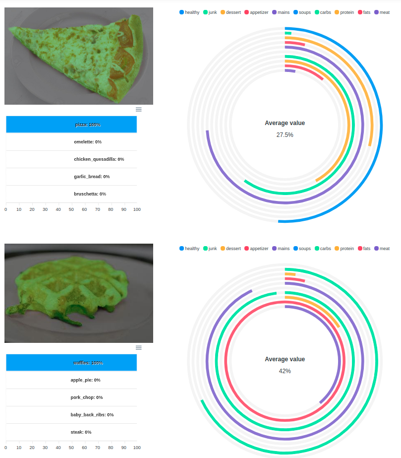

#  Calorie Counter
### Calorie Counter is saas app bringing more consciousness into food habits

# Table of contents
- [Implementation](#implementation)
- [Paper](#paper)
- [Results](#results)
- [Installation](#installation)
- [Usage](#usage)

##  Implementation
- Food classification: dataset [food-101](https://www.kaggle.com/dansbecker/food-101), pytorch model [inceptionV3](https://pytorch.org/hub/pytorch_vision_inception_v3/)
- Salient object detection, based on [u^2 net](https://github.com/xuebinqin/U-2-Net) implementation
- Web server implemented on [FastAPI](https://fastapi.tiangolo.com/)
___
##  Paper
[Calorie Counter: Recognition of food products,
    ready meals and their caloric values
    using neural networks.
    Poltavskiy A.V.](https://github.com/poltavski/CalorieCounter/blob/dev/CalorieCounter_paper.pdf)
___  
##  Live demo

**Visit portfolio to check [live demo](https://poltavski.github.io/projects/calorie_counter/)**

Screenshot from demo:


##  Results

<table>
  <tr>
    <td>Original image</td>
    <td>Recognized food</td>
  </tr>
  <tr>
    <td></td>
    <td></td>
  </tr>
  <tr>
    <td></td>
    <td></td>
  </tr>
  <tr>
    <td></td>
    <td></td>
  </tr>  
  <tr>
    <td></td>
    <td></td>
  </tr>
  
  <tr>
    <td></td>
    <td></td>
  </tr>
  <tr>
    <td></td>
    <td></td>
  </tr>  
  <tr>
    <td></td>
    <td></td>
  </tr>
  <tr>
    <td></td>
    <td></td>
  </tr>
  <tr>
    <td></td>
    <td></td>
  </tr>
</table>

___
##  Installation
### Local deployment

- Launch pipenv environment & install dependencies
- Run server

### Docker image

- Build or Export container
- Run image

### Release (binary)

- Download Release from github
- Use local deployment section to run
___
##  Usage

After deployment jump in web browser on configured or default (8000 or 8080) port

`http://0.0.0.0:8080/docs#/`

### [Food Image Labeling](http://0.0.0.0:8080/docs#/default)

#### Public endpoint for food image labeling by GET request.

### Args:

```
url: image url
percentage: show probabilities in percentage
```

### Returns:

```
Dictionary with image labels and probabilities
```

### Sample usage
#### Curl

```
curl -X 'GET' \
  'http://0.0.0.0:8080/image/label?url=https%3A%2F%2Fi.pinimg.com%2Foriginals%2F36%2Fa3%2F2e%2F36a32e2efcfce9a2d5daa5ebf1a7b31e.jpg&percentage=true' \
  -H 'accept: application/json'
```

#### Request URL

http://0.0.0.0:8080/image/label?url=https%3A%2F%2Fi.pinimg.com%2Foriginals%2F36%2Fa3%2F2e%2F36a32e2efcfce9a2d5daa5ebf1a7b31e.jpg&percentage=true

##### Response body with percentage = True

```
{
  "strawberry_shortcake": "95%",
  "red_velvet_cake": "2%",
  "chocolate_mousse": "1%",
  "creme_brulee": "1%",
  "panna_cotta": "1%"
}
```

##### Response body with percentage = False

```
{
  "strawberry_shortcake": 0.9516,
  "red_velvet_cake": 0.0154,
  "chocolate_mousse": 0.0071,
  "creme_brulee": 0.0058,
  "panna_cotta": 0.0058
}
```


___
###  Credits:
  Artem Poltavskiy 2021 (c). Visit my profile page for more: [poltavski.github.io](https://poltavski.github.io/)